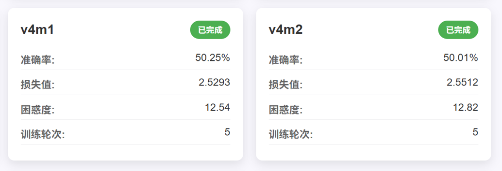
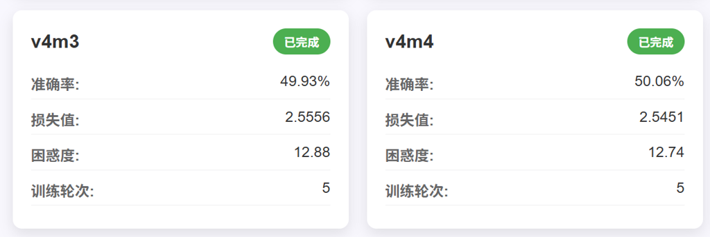
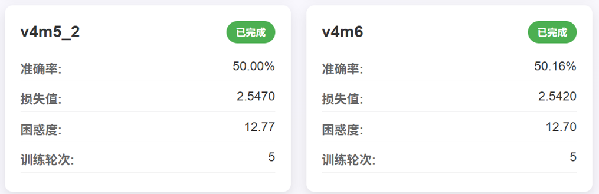
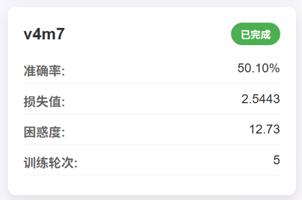

# 实验记录概览

共有4个Version，每个Version内部包含若干具体方法的尝试。
* Version2：Related Work。对于CLT模型的复现及微调（论文链接：https://transformer-circuits.pub/2025/attribution-graphs/methods.html）
* Version1 & Version3：由PT模型中扩展多组H node得到启发，修改Transformer残差连接
* Version4：由PT模型中扩展多组Z node得到启发，修改Transformer残差连接

所有模型的训练结果在网页：http://10.15.89.226:8085/ 上实时反馈（校内局域网访问）

# Version2:

### 实验方法：
__令每一层初始输入为 $\vec{x} $，经过Multi-head Attention模块后的输出为 $\vec{x'} $，MLP输入为 $\vec{y} $，经过MLP模块后的输出为 $\vec{y'} $__ 

**Method1**
* MLP处，第m层残差连接为 $\frac{\sum_{i=1}^{m-1}\vec{y'_i}+\vec{y'_m}}{m}+\vec{y_m} $。Attention处残差不变

**Method2**
* Attention处：第m层残差为 $\frac{\sum_{i=1}^{m-1}\vec{x'_i}+\vec{x'_m}}{m}+\vec{x_m} $，MLP处残差不变。

**Method3**
* 对于Method1的微调。将每一层权重 $\frac{1}{m} $改为可学习参数并输出最后一层的参数列表。具体来说：除第0层外，每层都拥有一个独立的权重列表，第m层权重列表长度为m+1，涵盖了0-m层所有层的可学习权重。对权重做Softmax归一化后得到每层权重分布。

### 实验结果：
从loss来衡量，Method3效果最好，略高于Baseline。

# Version1:

### idea推导

参照PT中多组H node（对应Transformer的Attention weight）的更新方法，每次Z node（对应Transformer的hidden_states）更新时都需要接受所有组H node的信息。在Transformer中，类比为：第i层Attention处的残差连接需要改为之前所有层Attention output的累加和。

另外，考虑到PT中没有直接对应MLP的部分，所以残差连接的修改位点位于Attention，MLP，还是二者组合，需要试验。

### 实验方法：

__令每一层初始输入为 $\vec{x} $，经过Multi-head Attention模块后的输出为 $\vec{x'} $，MLP输入为 $\vec{y} $，经过MLP模块后的输出为 $\vec{y'} $__ 

**Method1：Multi-head Attention残差修改**
* 修改 $\vec{x'} $处的add方式：第m层由对该层的输入 $\vec{x_m} $进行相加，变为加上 $\sum_{i=1}^{m-1}\vec{x'_i} $

**Method2：考虑Method1的message除以规模**
* 在Method1的基础上，第m层Attention的残差除以(m-1)

**Method3：MLP残差**
* 只在MLP的 $\vec{y'} $处进行相加，相加量改为 $\sum_{i=1}^{m-1}\vec{y'_i} $

**Method4：考虑Method3的message除以规模**
* 在Method3的基础上，第m层MLP的残差除以(m-1)

**Method5：**
* Method1的变体。每层的 $\vec{x'} $处和 $\vec{y'} $处都进行更新，相加量都改为 $\sum_{i=1}^{m-1}\vec{x'_i} $。与Method1唯一的不同之处在于 $\vec{y'} $处也加了。
* Method2、4的实验结果证明是否除以(m-1)对结果影响不大，所以残差连接没有除以(m-1)。Method6、7同理。

**Method6：**
* Method3的变体。每层的 $\vec{x'} $处和 $\vec{y'} $处都进行更新，相加量都改为 $\sum_{i=1}^{m-1}\vec{y'_i} $。与Method2唯一的不同之处在于 $\vec{x'} $处也加了。

**Method7：分别更新**
* 结合Method1和Method3： $\vec{x'} $处和 $\vec{y'} $处分别更新

### 实验结果：

效果最好的方法为Method3与Method4（都为修改MLP处的残差连接方法），其中Method3实验结果略好于Method4。但从loss来衡量，Method3，Method4的性能都略低于Baseline model

# Version3

### idea推导

Version3与Version1最核心的区别在于：不再直接记录先前层的Attention/MLP输出直接相加，而是在每一层Transformer训练/推理时都进行了先前层输出的重算。重算时更新了先前层Attention模块中的V矩阵，其余不变。（重算方法详细工程实现见#实验方法）

详细推导：由PT论文中（https://arxiv.org/pdf/2311.15211） 公式(27)( $G^{(t-1)} = 2 \sum_{c} Q_{h,c}^{(t-1)} V_c U^{(c)T} $)可知：多组H node对Z node更新的消息量为 $G = 2 \sum_{n} \sum_{c} Q_{h,c}^{(t-1)} V_{n.c} U^{(c)T} $。其中 $n $为H node的组别， $V_c = Q_z^{(t-1)} V^{(c)} $

其中： $V_c $的信息来源于上一轮的 $Q_z $而非更新该组时的轮次（类比Transformer中的第i层）。所以相当于Transformers中注意力模块的 $V $需要重算。

由 $V_c = Q_z^{(t-1)} V^{(c)} $可知： $V^{(c)} $没有发生改变，相当于Transformer层中的 $W^V $没有发生改变，仅有输入嵌入 $X $发生改变，即PT中的 $Q_Z $轮次不再是当时的轮次。所以重算 $V $的方法为：每层都重算，输入嵌入 $X $改成当前Transformer层的 $X $。

### 实验方法：

**Method1**

Attention处残差连接与原始模型相同。修改MLP处的残差为先前层重算的MLP输出累加。先前层MLP输出的重算方法为：
* 保留第一次Attention计算的attn_weights， $W^V $.weight， $W^O $.weight，仅更换输入嵌入矩阵X
* 输入嵌入X做input_norm
* Attention重算
* Attention残差连接
* post_attn_layernorm
* MLP计算
* MLP计算结果不做残差连接直接输出，作为重算后的MLP输出

**Method2**

MLP处残差连接与原始模型相同。修改Attention处的残差为先前层重算的Attention输出累加。先前层Attention输出的重算方法为：
* 保留第一次Attention计算的attn_weights， $W^V $.weight， $W^O $.weight，仅更换输入嵌入矩阵X
* 输入嵌入X做input_norm
* Attention重算
* Attention重算结果不做残差连接直接输出，作为重算后的Attention输出

即：Method1_v3与Method2_v3的差别为：残差连接的修改位点不同，先前层输出重算的截止位置不同（截至MLP输出/截至Attention输出）

**Method3**
* 与Method1基本相同，唯一不同之处在于MLP处残差和进行了归一化，且每一层的权重分布为1/m(Method 3.1)或可学习权重(Method3.2)

**Method4**
* 与Method2基本相同，唯一不同之处在于Attention处残差和进行了归一化，且每一层的权重分布为1/m(Method 4.1)或可学习权重(Method4.2)

### 实验结果：
对MLP处进行修改的实验结果仍整体优于对Attention处进行修改。有关MLP处修改的方法（Method1 3.1 3.2）中，Method3.2与Method3.1性能略好于Baseline，Method1性能????????

# Version4

### idea推导：
参照PT中多组Z node（对应Transformer的hidden_states）的更新方法，每次H node（对应Transformer的Attention weight）更新时都需要接受所有组Z node的信息。即：当前层Attention weight（ $QK^T $矩阵）计算要参考先前所有层Transformer的hidden_states提供的信息。

在Transformer中，类比为：第i层的 $QK^T $矩阵改为：当前与先前所有层 $QK^T $矩阵的和，注意力输出随之改为：Softmax( $\frac{\sum_i QK^T_i}{d_s} $) $V $。其中 $d_s $为scaling参数。

### 实验1： $d_s $的尝试

令之前所有层计算得的 $QK^T $矩阵组成向量 $\vec{qk} $，维数为当前transformer层数m。令scaling矩阵为 $\vec{s} $，维数为当前transformer层数m。所以attn_weight矩阵可统一改写为：Softmax $(\vec{qk}·\vec{s}) $。对于 $\vec{s} $取值有以下7种方法的尝试：

**Method1**
* 对于第m层，将 $\frac{1}{\sqrt{d_k}} $广播为向量 $\vec{s} $

**Method2**
* 对于第m层，将 $\frac{1}{\sqrt{d_k*m}} $广播为向量 $\vec{s} $

**Method3**
* 对于第m层，将 $\frac{1}{m\sqrt{d_k}} $广播为向量 $\vec{s} $

**Method4**
* 对于第m层，将 $\frac{1}{d_k^{a_m}*m^{b_m}} $广播为向量 $\vec{s} $。其中 $a_m,b_m $为可学习参数，正负性不做限定，初始值分别为0.5,1

**Method5**
* 对于第m层， $\vec{s_i}=\frac{1}{a_{mi}\sqrt{d_k}} $，其中 $a_{mi} $为可学习参数，限定为正值，初始值均为1

**Method6**
* 对于第m层， $\vec{s_i}=\frac{1}{a_{mi}d_k^{b_{mi}}} $，其中 $a_{mi},b_{mi} $为可学习参数， $a_{mi} $限定为正值，初始值均为1； $b_{mi} $正负性不做限定，初始值为0.5

**Method7**
* 对于第m层， $\vec{s_i}=\frac{1}{a_{mi}} $，其中 $a_{mi} $为可学习参数，限定为正值，初始值为 $\sqrt{d_k} $

### 实验1结果：
性能最好的scaling参数仍是Method1对应的原Transformer参数（分母为 $\sqrt{d_k} $）

注：图中的v4m5_2即为v4m5模型

### 实验2：v4m1基础上的可学习参数调整

参照了论文https://arxiv.org/pdf/2502.12170 中“2.2. Dynamic Dense Connections”的模型修改方法。

原始的v4m1得出的 $QK^T $矩阵（规模为Qseq_len*Kseq_len）可视为：Qseq中的每个token提出的query都具有同等的重要性权重，Kseq中的每个token具有的key也都具有同等的重要性权重。

目前的修改方法：通过可学习权重参数，使得Qseq的不同token/Kseq的不同token具有不同权重。权重参数的学习方法为：根据token相对位置学习（直接定义参数向量即可）、根据词嵌入推断（由词嵌入x_i经过MLP生成权重向量）

**Method1A**
* 在第i层Transformer中，为每个先前层&当前层共(i+1)层注册一个可学习的二维矩阵，规模为Qseq_len*Kseq_len。代表Qseq和Kseq的不同token都具有不同的可学习权重值，按照token相对位置学习。每个二维矩阵与 $QK^T $矩阵逐元素相乘，作为新的 $QK^T $矩阵。

**Method1B**
* 在第i层Transformer中，为每个先前层&当前层共(i+1)层注册一个长为Kseq_len的可学习向量，代表Kseq的不同token都具有不同的可学习权重值，按照token相对位置学习。每个向量与 $QK^T $矩阵广播相乘，作为新的 $QK^T $矩阵。

**Method1C**
* 在第i层Transformer中，为每个先前层&当前层共(i+1)层注册一个长为Qseq_len的可学习向量，代表Qseq的不同token都具有不同的可学习权重值，按照token相对位置学习。每个向量与 $QK^T $矩阵广播相乘，作为新的 $QK^T $矩阵。

**Method1D**
* 与Method1C相似，在第i层Transformer中，为每个先前层&当前层共(i+1)层学习一个长为Qseq_len的权重向量，代表Qseq的不同token都具有不同的可学习权重值。第i层Transformer的i+1个权重向量的学习方法为： $A_i=GELU(RMSNorm(X_i)W_1)W_2+bias $。
* 其中： $A_i $规模为Qseq_len*(i+1)，i+1个列向量分别代表总共i+1层中每一层拥有的各query token权重； $X_i $规模为Qseq_len*hidden_size，为第i层当前层的输入嵌入，即 $A_i $的权重由当前层的输入嵌入推断而来； $W_1 $ 规模为hidden_size *(i+1), $W_2 $规模为(i+1) *(i+1)；bias为长i+1的可学习向量，在相加时广播Qseq_len次。

**Method1E**
* 与Method1B相似，在第i层Transformer中，为每个先前层&当前层共(i+1)层学习一个长为Kseq_len的权重向量，代表Kseq的不同token都具有不同的可学习权重值。第i层Transformer的i+1个权重向量的学习方法为： $A_i=GELU(RMSNorm(X_i)W_1)W_2+bias $。
* 其中： $A_i $规模为Kseq_len*(i+1)，i+1个列向量分别代表总共i+1层中每一层拥有的各key token权重； $X_i $规模为Kseq_len*hidden_size，为第i层当前层的输入嵌入，即 $A_i $的权重由当前层的输入嵌入推断而来； $W_1 $ 规模为hidden_size *(i+1), $W_2 $规模为(i+1) *(i+1)；bias为长i+1的可学习向量，在相加时广播Kseq_len次。

### 实验2结果：

* 从loss/perplexity来衡量，上述五种方法均略高于baseline。其中DE两种由输入嵌入推断的方法又略高于ABC三种由相对位置推断的方法，但五种方法的提升幅度均比较有限。
* 但从eval_time来衡量，这几种方法在推理时间上明显长于baseline。

### 实验3：有关可学习token权重与先前层QK^T累加的作用探究

从v4m1A~v4m1E模型对于准确率提升的效果来看，需要明确的问题是：v4m1A ~v4m1E添加的两个优化模块： $QK^T $叠加与token权重，哪个模块对准确率提升起到了较大效果，以及哪个模块对eval_time占用了较多时间。

* 只考虑 $QK^T $叠加模块，则为v4m1模型。
* 只考虑token权重模块，重新在baseline基础上设置实验

**MethodC**
* 与Method1C的不同在于：第i层Transformer只为当前层学习一个长为Qseq_len的权重向量，代表Qseq的不同token都具有不同的可学习权重值。

**MethodD**
* 与Method1D的不同在于：同样只为当前层推断一个长为Qseq_len的权重向量。学习方法为： $A_i=GELU(RMSNorm(X_i)W_1)W_2+bias $。此时W_1规模改为hidden_size*1，W_2规模改为1 *1，bias规模改为长度为1的向量

### 实验3结果

