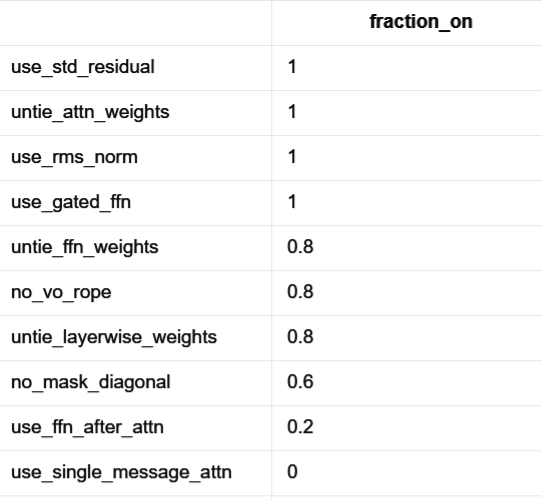
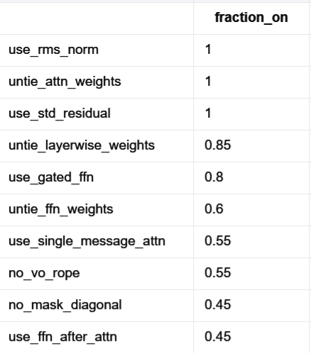
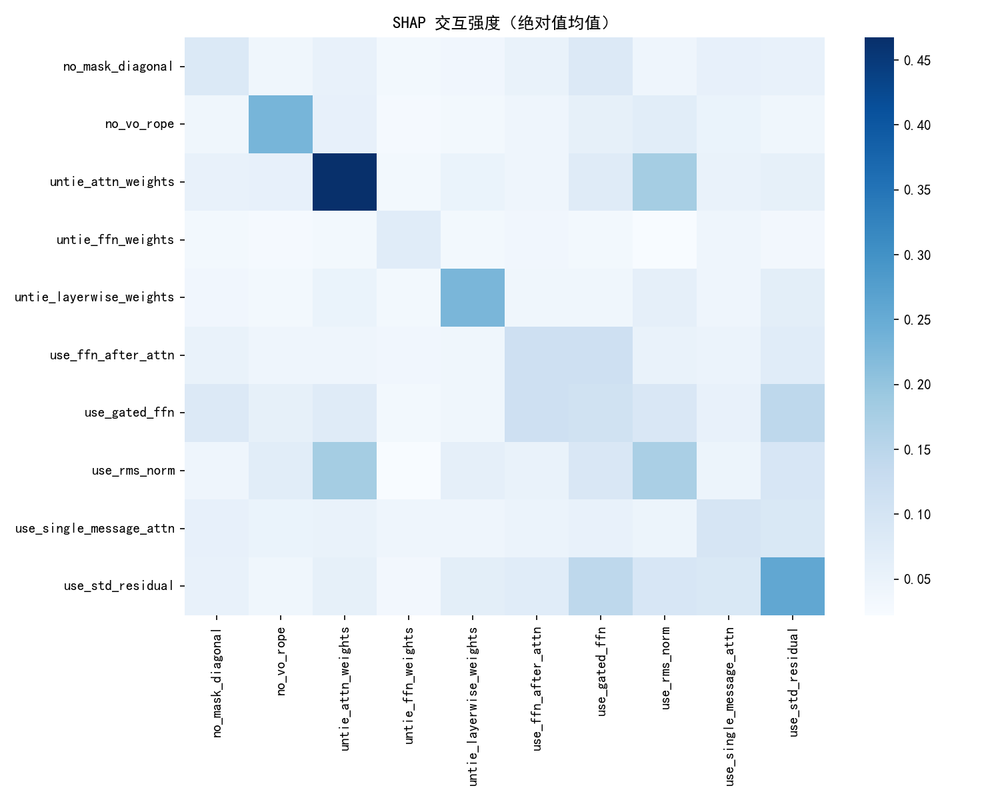
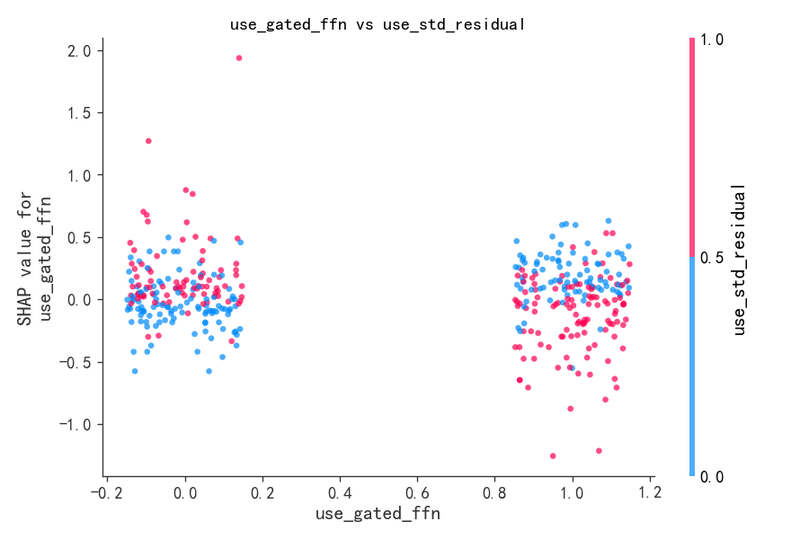
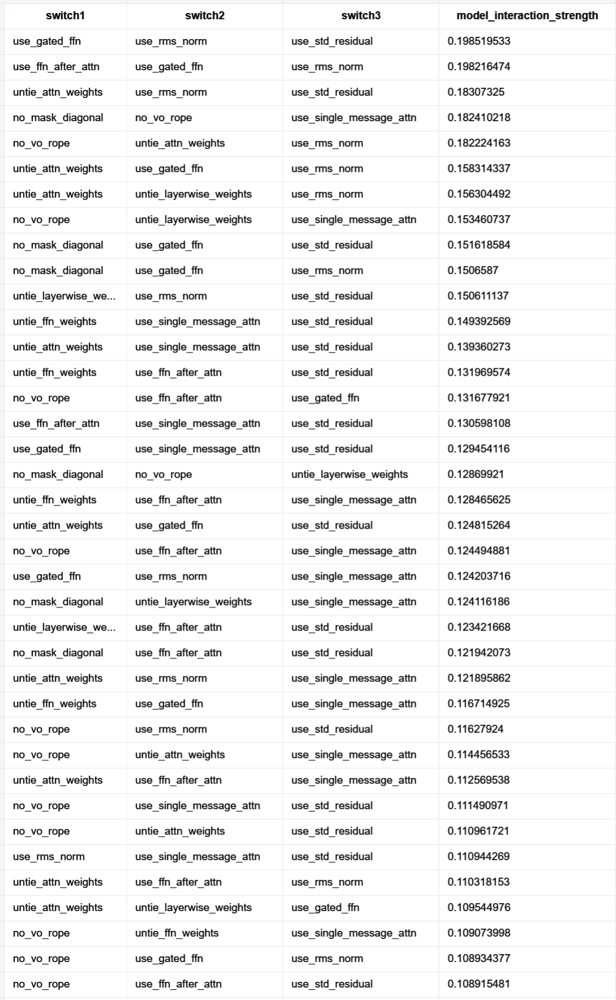
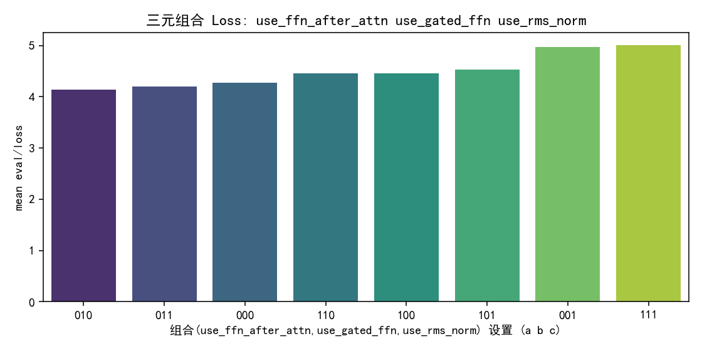
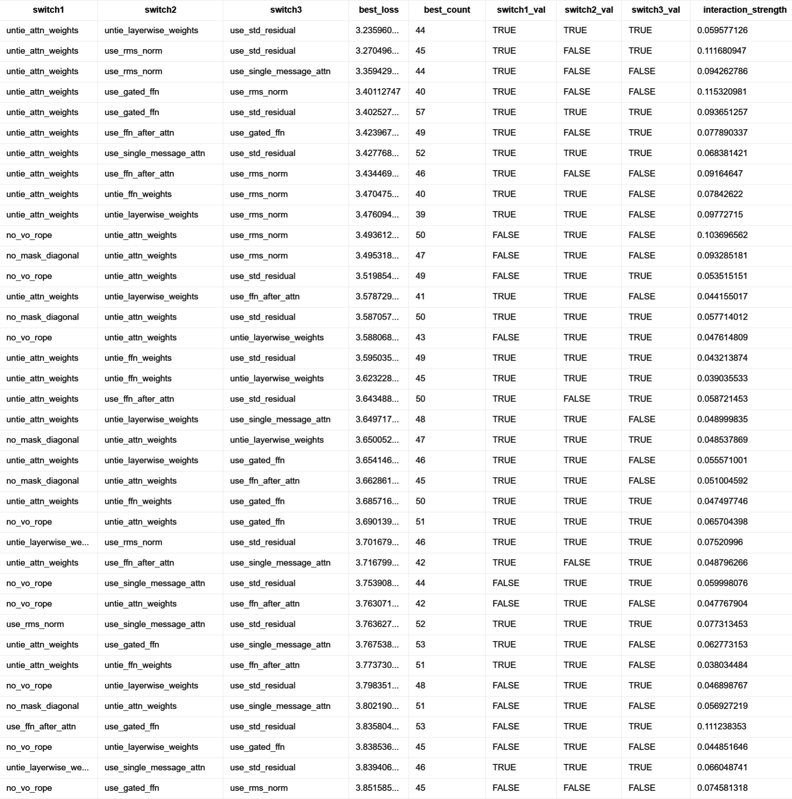

# 一元分析

使用XGBoost+SHAP方法，分析单个开关开闭情况对于eval/loss的影响值大小。

### 具体影响值分析

* 一个点为一个实验
* 红色点表示开关打开
* 蓝色点表示开关关闭
* SHAP的原理为拟合出每个实验数据点中单个开关开闭造成的loss改变情况。横轴即为各实验数据点中某个开关开闭对loss的影响

规律分析：
* 前五个开关表现出明显的影响，即：单个开关开闭就会造成显著的loss影响。
* 后五个开关在单开关研究中发现开闭都可能造成loss的正反向不同影响。推断可能是与其他开关存在共同作用，也可能本身影响就不大。

### 单开关影响强度分析

横轴代表SHAP值的绝对值的平均数，表征单个开关的影响强度。

### 效果较好实验中单开关开闭情况

最好的5组实验中各开关打开情况占比

最好的20组实验中各开关打开情况占比

可看出上面柱状图中前三组开关全部打开，其他开关单个开闭情况没有非常明显的规律（存在明显的噪音）。

### 总结:
* 关注untie_attn_weights & use_std_residual & use_rms_norm（1 2 3号开关。**后续所有开关的编号均以"单开关影响强度分析"柱状图中的次序为准**）开关开闭的影响，这三者存在非常明显的决定作用。
* 部分开关（如后五个开关）红蓝点交错现象非常明显，可能同其他开关存在多元协同作用。需继续分析。

# 二元分析

### 二元交互强度分析

描述了两两之间的交互强度。可看出1 3号开关（即untie_attn_weights & use_rms_norm）、2 6号开关（即use_std_residual & use_gated_ffn）之间存在明显的交互关系。其他两两之间交互关系不大。

具体交互关系如下：**（所有分布图见interaction_analysis文件夹）**

* 横轴为开关1的两个取值（0&1），红蓝色为开关3的两个取值（开或关）。纵轴数值为两个开关取值对loss的影响。
* 从横轴01取值来看，开关1打开对loss下降具有显著影响
* 从红蓝色分布来看：
  * 开关1关闭的情况下，开关3打开（蓝色）会对loss造成一定的下降作用
  * 开关1打开的情况下，开关3关闭（蓝色）会对loss造成一定的下降作用
  * 即开关1 3一闭一开效果略好一些
  * 最差情况为1 3全部关闭，最好情况为1开3闭。二者效果差别较为显著

* 横轴为开关6的两个取值（0&1），红蓝色为开关2的两个取值（开或关）。纵轴数值为两个开关取值对loss的影响。
* 从横轴01取值来看，开关6打开对loss下降影响不大
* 从红蓝色分布来看：
  * 开关6关闭的情况下，开关2关闭（蓝色）似乎会对loss造成一定的下降作用
  * 开关6打开的情况下，开关2打开（蓝色）似乎会对loss造成一定的下降作用，且较为明显
  * 即开关2 6同开同闭效果似乎略好一些
  * 最差情况为6闭2开，最好情况为6开2闭。二者效果略有差别。

### 开关具体取值情况分析

**分析方法：**

给定一对开关，共存在四种取值（2*2）。对于每种取值对应的样本共best_count个（如开关1=true&开关3=false的所有样本共best_count=88个）的loss取平均，得best_loss。

按best_loss升序排序，并附带两开关之间的交互强度大小。

（下列数据对应的xlsx表格为interaction_summary_pairs.xlsx）

可看出：
* 开关attention_weights（开关1）在loss最低的几个样本中几乎全部打开。
* 开关1开3闭（即交互强度最大的一组）效果最为显著，明显好于其他组别。

### 总结

* 开关两两关系中交互作用最显著的是开关（1 3）与开关（2 6）组合。其中开关1 3组合的交互作用最强。除去这两组外，很难找到有明显交互作用的组别。
* 可能需要重点关注一下开关1 3之间的关系。一元分析时发现1和3作为单个开关就会对loss的变换造成显著影响，二元分析时发现1 3之间还存在较强的相互作用。

# 三元分析（作为参考）

### 三元交互强度分析

下图为交互强度靠前的部分组别。完整数据见"three_way_model_interactions.xlsx"文件。

第一组具体分布：**（所有分布图见interaction_analysis文件夹）**

* 这一组的交互系数最大，但看起来刨去最低值和最高值之外，相差并不显著。而最低值和最高值之间仅仅差了use_std_residual一个开关，但导致了显著的极差。
* 也许可以推断出：use_std_residual开关可能发挥重要的作用，但前提是use_gated_ffn与use_rms_norm全部打开。

第二组具体分布：

* 这一组好像相差不算很大。如何分析？

第三组具体分布：

* 这一组正好对应了1 2 3号开关，即单开关影响最大的三个。可以看出八个数值之间都有显著的差别。
* 另外一个特殊的现象是，三个开关的01取值完全对称，也就是101与010正好是最好最差，100与001正好是次好次差等等。
* 如何解释这一现象？

### 开关具体取值情况（参考）
完整结果见文件"interaction_summary_three.xlsx"

# 观测结果及疑点总结

### 观测结果
* 开关1 2 3作为单个开关时就会有显著的影响（无需考虑其他开关情况）
* 开关组1&3、开关组2&6之间相互影响较为显著。尤其是开关组1&3
* 开关组1&2&3在三元分析时也具有显著的影响，也许可以重点研究开关1、2、3相关的性质？

### 疑点
如何解释三元分析中的第二、第三组的数据，尤其是第三组（开关1&2&3）的相关规律？