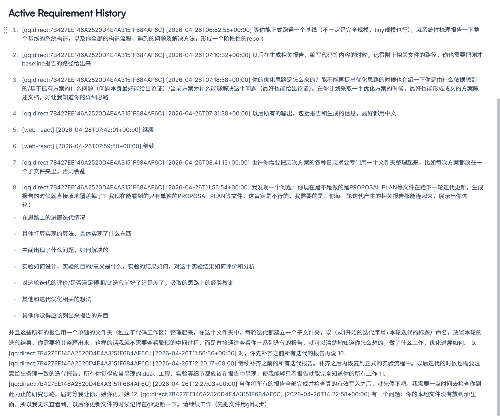

## 对DeepScientist运行机制的个人理解（可能存在误差）

每轮迭代的大致流程：
* 构建指令
  * 运行builder，获取system提示词等既定规则prompt，结合当前阶段（如baseline/experiment/write等），从skills中获取相关的指令信息
  * 利用builder构建完整的结构化指令
* 指令执行
  * 将prompt发送至基座模型，基座模型基于prompt思考生成具体的下一步指令
  * Daemon解析具体指令，调用MCP工具（bash_exec运行，artifact处理文件修改，memory处理信息存取）进行具体执行
* 更新git状态
* 下一轮循环
  * 通过decision评估该轮反馈，决定当前阶段是否需要推进
  
## 实验过程中给出的额外需求
* 每轮实验方案尝试结束后，应当独立设计分析方案与分析实验，充分挖掘成功/失败结果背后的具体指标变化（如：哪些正确跨度被弄丢、哪些标签被改错、哪些结构边界发生变化），以此详细分析该方案为什么好/不好
* canvas的界面仍然较为抽象，主要体现在每个节点无法清晰看出执行的任务名称、点开每个节点后也无法直观了解到该节点代表的实际idea/工程实现与实验/结果/分析。所以需要及时编写同步的迭代报告：
    * 报告的版本划分标准为：1.提出了一个idea并成功实现、成功做了实验并验证了结果，为一个完整版本； 2.对于当前的一个或一组idea设计了分析方案，进行了分析实验，对于实验结果（即背后的具体指标）进行了完整的分析，获得了成功/失败的具体原因解释，为一个完整版本； 3.基于之前所有的实验结果、实验分析，通过额外的文献查阅与深入思考总结，复盘并推出了新的待试探研究方向，为一个完整版本。
    * 每版本报告需要展现的内容为：1.关系综述。该版本相对于先前版本有何继承或迭代关系 2.idea/方案，及通过什么依据构思出该idea/方案，该方案为何有解决问题的可能性 3.具体的工程实现日志（实现的内容，解决的工程问题） 4.实验结果。 5.对于结果的评价与结论 6.下一步计划 7.其他需要补充的方面。如相关的代码文件等需要附上路径证明已实际实现并跑通等。
* 对于具体分析指标的选择，除了需要在意表面的结果（如句法树的跨度、标签、边界的错误率与错误类型），还需要倾向于寻找表面结果背后更深层的作用机制，以此尝试找出问题的最底层原因
    * 一个例子是（选自AI的回复）：
    * >有，而且这个问题很关键：跨度、标签、边界还是比较“结果层”的指标；更底层我会再看 5 类：  1. 组合/分裂点：同一个跨度内部到底从哪里切开，例如 VP 是切在动词后还是宾语后。这能判断是不是 CKY 组合结构被规则偏置带歪。 2. 结构形状：树深度、平均分支数、一元链长度、短跨度/长跨度分别损失多少。这能看模型是不是变得过度扁平、过度右/左分支，或在长依赖上崩。 3. 规则三元组：父节点-左子节点-右子节点的组合变化。门控规则如果伤害大，通常会在这里显示出“PTB 常见组合覆盖了跨域正确组合”。 4. 词汇和句型条件：句长、罕见词/子词长度、标点、POS 模式、领域专有表达。它能解释错误是不是来自领域词汇，而不是 parser 结构机制本身。 5. 置信度与扰动敏感性：哪些高置信判断被改掉、哪些低置信判断被修复；如果高置信正确结构被规则改坏，那说明干预方式太强。 当前已经启动的审计先覆盖跨度/边界/标签和非金标结构改动。我会在它完成后直接基于保存下来的预测树追加“分裂点、树形深度、一元链、规则三元组、长度分桶”这些更底层指标；置信度类如果需要 parser 内部分数，我再补一个轻量打分导出。

## 目前迭代的路线概览（大概48小时，信息摘自AI同时编写的迭代报告）
_注：详细的报告内容已放在相同路径下`iteration_reports`文件夹中的其他md文档中。_
### 第001主版本：baseline构建
### 第002主版本：跨领域测试集评测链路构建
### 第003主版本：早期结构增强与词汇诊断

本轮旨在排除工程阻塞，为后续解决“跨域句法分布差异”和“PTB新闻域过拟合”探索初步的候选机制。

**Idea 1: PTB-only 结构多样化增强 (Structure-diversifying tree augmentation)**
*   **提出的Idea:** 论文指出跨域解析性能下降主要源于结构分布差异。该方法尝试在不引入目标域数据的情况下，仅从PTB（新闻域）自身派生出保守的“结构变体树”，以增加模型训练时看到的合法结构组合，试图缓解过拟合。
*   **具体实现机制:** 从PTB风格的训练树中提取合法的成分树（constituent tree），根据设定的规则（如限制句长、树深）生成新的结构组合变体。关键约束是保持标签集合合法，绝不引入目标域的新标签。生成的变体树与原始树合并构成新的训练集。
*   **实验设计:** 极小规模（tiny）工程诊断。输入20棵树，生成20棵增强树，合并成40棵树进行tiny级别的Berkeley parser训练和评测（dev/test）。
*   **结果:** 成功跑通工程链路（读取、训练、保存、加载、评测），且未引入新标签。但绝对分数极低（tiny test F1 = 2.83）。
*   **分析:** 证明了结构增强数据接入训练链路的*工程可行性*。但极小的样本量无法证明其跨域收益，需进入大规模对照实验。

**Idea 2: PTB-only 词汇鲁棒性扰动 (Lexical robustness augmentation)**
*   **提出的Idea:** 这是一个与结构增强互补的方向。假设模型过度依赖PTB新闻域的特定词汇和上下文搭配，在遇到词汇风格迥异的目标域（如对话、论坛、评论）时会失效。因此提出对训练数据的叶节点（单词）进行扰动。
*   **具体实现机制:** 保持PTB训练树的**金标结构 (gold tree structure) 和非终结符标签完全不变**。仅对叶节点（leaf tokens）进行受控的替换，具体方式包括叶节点掩码（leaf masking）或替换为未知词标记（`[UNK]` replacement）。
*   **实验设计:** 极小规模工程诊断。20棵原树保留，生成17棵有效扰动树，合并成37棵树。在tiny设定下进行训练和测试。
*   **结果:** 工程链路跑通，未引入新标签或新词性标注（POS tag）。tiny test F1 = 2.50。随后将此tiny模型接入MCTB_en五域测试入口，证明了端到端五域评测链路闭合（macro F1 = 3.07）。
*   **分析:** 证明了词汇扰动机制的*工程可行性*和五域评测入口的可用性。但由于缺乏对照组，无法判断扰动是否带来实际收益。这促成了下一轮必须进行成对的对照实验。

### 第004主版本：词汇扰动复盘与公平对照

本轮通过逐步放大的对照实验，严格复盘“词汇扰动”机制的有效性，并最终纠正了未控制训练量的实验偏差。

**Idea 1: 词汇扰动成对小规模诊断 (Paired small-scale diagnostic)**
*   **提出的Idea:** 为解决上一轮无对照组的问题，提出固定训练集规模的成对比较，以隔离验证词汇扰动带来的影响。
*   **具体实现机制:** 复用第3轮的叶节点词汇扰动生成器（leaf masking / UNK replacement）。
*   **实验设计:** 对照组（Original）：1000棵PTB原树。增强组（Lexical-aug）：同一1000棵原树 + 946棵词汇扰动树。使用相同的tiny非BERT解析器配置在五域进行评测。
*   **结果:** 增强组 macro F1 (3.82) 优于对照组 (1.85)，delta +1.97，五域全部正向。
*   **分析:** 出现了方向性的正向信号，但这只是小规模的非BERT模型结果，支持进一步放大诊断规模。

**Idea 2: 词汇扰动放大成对诊断 (Scaled paired diagnostic)**
*   **提出的Idea:** 将上一阶段的正向信号放大到更大的PTB子集，以检验该信号是否稳定。
*   **具体实现机制:** 同上（叶节点替换）。
*   **实验设计:** 对照组（Original）：3000棵PTB原树。增强组（Lexical-aug）：同一3000棵原树 + 2823棵扰动树（总计5823棵）。使用非BERT小模型进行训练和五域评测。
*   **结果:** 增强组 macro F1 (13.32) 显著优于对照组 (7.84)，delta +5.48，五域全部正向。
*   **分析:** 正向信号在更大子集上得到确认。**但是，此时发现了严重的设计缺陷：增强组的训练样本总量（5823）远大于对照组（3000）**，无法区分收益是来自“词汇扰动机制”还是仅仅因为“数据量增加了”。

**Idea 3: N+M 训练量统一对照 (N+M budget control diagnostic)**
*   **提出的Idea:** 提出严格的 N+M 训练预算控制，以隔离“数据量增加”这一混杂因素。
*   **具体实现机制:** 保持原有的词汇扰动生成方式。关键在于如何构建“干净的对照组”。
*   **实验设计:** 干净控制组 (`clean_control`)：3000棵原始树 + **2823棵同源原树的重复样本**。增强组 (`lexical_augmented`)：3000棵相同的原始树 + **2823棵同源的词汇扰动树**。这保证了两组都在5823棵树上训练，且额外的2823棵树在“来源分布”上完全一一对应。
*   **结果:** 结论反转！干净控制组 macro F1 (14.94) 反而优于增强组 (13.32)，delta -1.62。五域中仅一个领域正向，其余负向。
*   **深度分析:** 严格控制训练量后，词汇扰动的“假性收益”消失。这表明先前的提升纯粹是因为小模型看到了更多的样本。当前的叶节点掩码策略破坏了有用的词汇-结构对应关系，在同等预算下甚至不如简单的重复样本。**该词汇扰动路线被正式降级**，研究主线转向基于文献启发的“底层结构机制”。

### 第005主版本：解析机制路线选择

在确认表层数据（词汇）改造无效后，本轮决定深挖解析器的第一性原理，从内部的打分和解码机制入手。

**Idea 1: 边界辅助训练 (Span-boundary calibrated parsing mechanism)**
*   **提出的Idea:** 跨领域解析错误往往在于模型在遇到新颖的表达时，选错了短语的边界。当前的机制（先选跨度，再给跨度打标签分）可能导致模型被高分的错误标签误导。提出在 `span chart` 上增加一个明确的 `span-boundary confidence`（跨度-边界置信度），**显式地辅助训练“这个跨度是否应该成为一个合法成分”**。
*   **具体实现机制:** 训练数据保持纯PTB。在模型内部，除了计算标签得分，还计算该跨度作为合法边界的置信度，并引入辅助损失（boundary auxiliary loss），总损失函数为原损失函数+辅助损失。
*   **实验设计 & 中间问题 (求和 vs. 归一化):**
    *   在放大到 256/64/64 规模时，最初的“求和式”边界辅助目标导致模型崩溃（test F1 下降至 9.89）。
    *   **修正机制:** 诊断发现，长句子的候选span数量庞大，求和式损失会呈平方级膨胀，压垮主解析目标。改为**按有效span数进行归一化 (Normalized auxiliary objective)**。
*   **结果:** 修正后的归一化机制在 256 规模下反超基线 (18.41 vs 11.87)。进一步放大到 512 规模并在 MCTB 五域评测，机制组五域全涨（macro 26.84 vs 15.68）。放大到 1024 规模时，五域依然全涨，但增益大幅缩小 (macro +0.49)。
*   **深度分析:** 错误分析表明，该机制确实提高了中长 span (6+ 和 11+ 长度) 的召回率，但也牺牲了部分短 span。更底层的图表诊断显示，该辅助目标像是一个“缺乏选择性的弱正则器”，它把正确的 span (`recovered_gold`) 和错误的 span (`added_error`) 的分数一起推高了。这不足以成为最终方案。

**Idea 2: 标签条件规则 CKY (Label-conditioned rule CKY decoder)**
*   **提出的Idea:** 既然在局部打分层面上加“辅助推力”不够精准，那就去改负责把局部分数组合成整树的“大脑”——解码器（Decoder）。提出将规则约束放入 CKY 动态规划过程中。
*   **具体实现机制:**
    *   传统的 CKY 通常只在局部算分，最后拼树。
    *   新机制：在 CKY 的每个 span 上，**按不同的标签 (Label) 分别保留最优状态**。并且引入训练集的父子标签规则（例如 `S -> NP VP`）。只有当候选的组合符合已知规则时，才允许成树（或给予软规则惩罚加分）。
*   **实验设计:** 构建一个独立的软/硬规则 CKY 原型，进行不改变原模型的合成图表（synthetic chart）打分烟测。
*   **结果:** 原型验证通过。在加入规则约束后，解码器放弃了局部分数更高但规则未知的树，成功选择了全局规则合法的树。
*   **分析:** 证明了解码层的结构约束比局部打分更有决定性。软规则（惩罚而不是直接硬禁止）被认为是跨领域更安全的做法。这是比单纯的 boundary loss 更深刻的机制，被选为后续研究的重点方向。

### 第 006 轮：标签链与解析图信号审计 (尝试局部修补)

本轮的核心目标是：在不重训模型的前提下，试图通过“后处理替换”或“解码前加分”来利用图表（Chart）中潜在的正确信号。本轮经历了6个子阶段。

*   **Phase 1-3: 标签链后处理与规则包组合 (Post-decode Label-chain Calibration)**
    *   **提出的 Idea 与机制:** 在最佳树（best-tree）解码完成后，不改变短语的边界，仅利用PTB训练集中的高频窄规则来替换标签。机制从粗到细：从最初的 `ADJP -> VP`，精细化到包含上下文条件（例如：子结构为 `TOKEN:VBN PP`，长度为 `6-10`，左右边缘词性为 `VBN/NN`），最后将多条互不冲突的安全规则（如加上 `SBAR -> PP`）打包。
    *   **设计的实验:** 在 PTB dev 上进行安全审计（要求不破坏边界，0 回退），并在 MCTB 控制预测上检查触发次数。
    *   **实验结果:** 虽然在 PTB dev 上实现了个位数的标签救回（rescues），但在 MCTB 128x5 子集上，两规则小包仅仅触发了 **3 棵树**，宏 F1 仅提升 +0.00023。
    *   **深度分析:** 机制绝对安全，但**覆盖面窄得毫无意义**。这说明直接在输出树上做后处理替换，根本无法触及跨域解析的核心错误。

*   **Phase 4-5: 图表级备选筛选与标签分数边界探测 (Chart-level Alternative Mining & Margin Probing)**
    *   **提出的 Idea 与机制:** 质疑模型是不是根本没预测出正确标签？通过脚本遍历强模型图表中每个 span 的 Top-k 标签，并探测触发规则时的分数差（Margin = `to_score - from_score`）。
    *   **设计的实验:** 扫描完整 PTB dev 1700 句的底层 Chart，对比金标寻找潜在修正事件。
    *   **实验结果:** 震惊地发现 PTB dev 的 Chart 中存在 **2318** 个金标位于 Top-3 备选中的机会！但探测发现，触发候选时的 Margin 非常大（如 -1.40 到 -2.32）。
    *   **深度分析:** 局部图表里**不缺正确信号**，但它们无法进入最终解码树。且模型在犯错时并不是“低置信度的犹豫”，而是“坚定的选错”，简单的分数阈值无法进行修正。

*   **Phase 6: 解码前标签偏置微烟测 (Pre-decode label bias)**
    *   **提出的 Idea 与机制:** 既然事后改没用，那就**事前干预**。在满足固定条件（如 `S -> VP`，长度 11-20）的 Chart span 上，强制加上一个 Bias 分数（0.5, 1.0, 1.05, 2.0），然后再交由模型进行 CKY 解码。
    *   **设计的实验:** PTB dev 128 + MCTB 五域 128 微烟测。
    *   **实验结果:** 安全档位（1.0）完全不改变 PTB 结果，MCTB 仅改变 2 棵树；强档位（2.0）MCTB 改变增多，但 PTB dev 的 F1 降至 93.40（出现 13 个句级退化）。
    *   **深度分析:** 单标签局部加分机制过于脆弱。加分少没效果，加分多会立刻破坏原有的正确结构。**局部修补路线被彻底宣判死刑，必须转向全局/整树层面的操作。**

### 第 007 轮：整树候选池与选择器审计 (转向整树重排)

本轮放弃了“改单一标签”，转而探索“从图表生成多棵完整候选树，再从中挑选”的 Reranking 机制。

*   **Phase 1: 整树候选池与 Oracle 诊断 (Whole-tree Candidate Pool & Oracle)**
    *   **提出的 Idea 与机制:** 通过图表局部标签扰动或轻量温度采样，强制解码器为每句话生成 3-8 棵完全合法的**候选树池 (Candidate Pool)**。计算 Oracle（偷看答案的理论上限）和无标签选择器（Selector）的实际得分。
    *   **设计的实验:** PTB dev 128 句上的上限测试与选择器测试。
    *   **实验结果:** Oracle 带来了 **+0.5560** 的惊人增益（10次救回，0次退化）。但第一版基于单一分数差的 Margin Selector 得分为 **-0.1112**（1次救回，3次退化）。
    *   **深度分析:** **“好树”确实存在于候选池中！** 现在的唯一技术瓶颈是：如何在不看答案的情况下，设计出能挑出这棵好树的过滤规则。

*   **Phase 2-3: 无标签阈值选择器修复与全量验证 (Threshold-based Selector Repair)**
    *   **提出的 Idea 与机制:** 修复第一版选择器。错误分析发现，模型极易因为局部歧义而把短 span 删空。于是引入两个新特征：1. `target_empty_margin >= 0.15`（候选标签得分必须比“空结构”得分高出 0.15 的优势）；2. `min_span >= 3`（直接屏蔽长度小于 3 的超短跨度修改）。
    *   **设计的实验:** 在 PTB dev 1700 句和 MCTB 128x5 上进行全量安全验证。
    *   **实验结果:** 修复后，PTB dev 退化降至 0。但在 MCTB 128x5 上，宏平均为 **-0.0765**（3/5个领域下降）。
    *   **深度分析:** 单纯限制跨度和空标签，只是挡住了浅层的错误，它并没有赋予选择器“判断全局结构是否更优”的能力。

*   **Phase 4-5: 空结构风险门控与 1000x5 放大验证 (Max-empty Risk Gate Scale-up)**
    *   **提出的 Idea 与机制:** 进一步增加 `--selector-max-empty-margin` 门控（如设为 1.3）。即：如果模型在某个位置“极其强烈地想要删掉结构（空结构得分极高）”，选择器就直接拒绝在该位置采纳任何新候选，以避开高危雷区。
    *   **设计的实验:** 确认该门控在小样本安全后，直接放大到 MCTB 五域 1000x5（共 5000 句）进行终极裁决。
    *   **实验结果:** 宏平均仅剩微弱的 **+0.0048**，且 Literature 域转为负向（-0.0241）。整体只有 21胜 / 19负 / 4960平。
    *   **深度分析:** 彻底证明**“无标签简单阈值选择器”路线走入死胡同**。21胜19负的抵消状态说明阈值门控只是在随机碰运气，无法稳定利用 Oracle 的巨大空间。必须转向包含更多维度特征的全局结构风险重排或回到训练端。

### 第 008 轮：全局结构风险与结构邻域训练 (触及架构底座)

本轮兵分两路：一路在测试端构建更复杂的全局重排器；一路在训练端直接重写模型的对比损失函数。

*   **Phase 1-2: 完整树级全局结构风险重排 (Whole-tree Global Structural Risk Reranking)**
    *   **提出的 Idea 与机制:** 彻底抛弃局部 Margin 阈值，改用全局特征给候选树打分。机制引入了：边界变化数量、标签签名差异、**父子规则签名变化 (rule-signature diff)**，并加入了极其严格的 **`max-score=1.0` 总风险预算**（限制模型对单棵树的整体修改幅度）。
    *   **设计的实验:** PTB8 极小烟测 -> PTB128 放大验证。
    *   **实验结果:** 在没有总预算时，PTB8 暴降 -0.7782。加上总预算和短跨度保护后，PTB128 恢复到 +0.0556（1胜0负）。
    *   **深度分析:** 结果与上一轮的简单双阈值门控**完全持平**。这意味着这些复杂的全局特征在加上严苛保护后，变得过度保守，根本没有产生“新的选择能力”。重排器方案暂缓。

*   **Phase 3: 结构邻域对比损失 (Structure-neighborhood Contrastive Loss)**
    *   **提出的 Idea 与机制:** 既然挑选太难，那就从源头（训练端）解决。在 Parser 训练 Loss 中挂载一个局部对比项 hook。负例不再是随机泛泛的，而是针对金标树精细构造的**结构邻域违规项**：同跨度错误标签、邻近重叠 span、违反父子重叠约束的 span、兄弟节点异常合并等。通过 Hinge Loss 惩罚这些具体错误。
    *   **设计的实验:** PTB256 / MCTB64 的 BERT-base 方向性匹配诊断。
    *   **实验结果:** 机制成功触发（单树产生 244 个惩罚项）。但在测试中，PTB test 略负 (-0.04)，**MCTB 宏平均为负 (-0.43)**，特别是 Literature 和 Review 领域大幅回退。
    *   **深度分析:** 宽泛的 PTB-local 邻域压力导致模型学到了“更加死板的 PTB 结构偏好”，反而隔离/破坏了跨领域所需的泛化能力。广义邻域 Loss 被降级。

*   **Phase 4: 按金标跨度筛选可靠强竞争项 (Top-k Reliable Hard Competitors)**
    *   **提出的 Idea 与机制 (当前活跃状态):** 针对上一阶段“压力太散、负例太泛”的问题进行修复。机制改为：按每个 Gold Span 进行分组，只挑选具有正向 Hinge Loss、且在结构上有明确解释价值的 **Top-k 强竞争项**进行精准打击。
    *   **设计的实验:** 定义了严格的烟测和成功标准（要求 PTB 不伤，MCTB 多数域不退化）。
    *   **当前状态:** 已完成代码功能和语法烟测，准备进入下一步的 PTB/MCTB 成对小规模评测。

## 问题总结与思考

* 长期记忆 $\Rightarrow$ prompt性质的识别(上图所示)
  * 在运行初期交互时就提出了：“整理文档”的要求以及具体的版本划分粒度标准（最初直接以canvas中的一个节点作为一个版本，造成分割过细；后来明确要求重新划分）、实验完成后设计分析实验、多次失败后系统性复盘等流程要求。大概迭代一天后，发现上述的所有流程全部都被遗忘。
  * 排查了对应的memory工作区的knowledge/active-user-requirements.md文档，发现Active Requirement History部分负责记录长期的要求，但对于要求的识别较为混乱：能够将“定期构建更新报告”的要求识别存储，但没将“报告版本划分的粒度”要求存储；同时存储了许多不应该认为是长期要求的条目（如“继续”）
  * 问题应该不在于上下文长度限制/历史对话压缩导致的灾难性遗忘（储存在memory中的条目基本都被有效记忆），而在于对于指令性质的识别。许多明显算作长期指令的语句没有被存储，许多无关紧要的要求被存储。
  * 是否需要专门进行相关的训练，或改进系统架构，使其具备更高效的识别能力？其中一个可行的方法是在架构层面实现任务的结构解耦：
    * 原先在生成下一步指令时可能由同一个大模型agent同时负责思考思路、判断记忆写入、设计工程实现方案等问题，可能因此导致某些需求无法被充分完成甚至被忽略。
    * 能否实现对于不同层面的问题设置多个并行的agent分工解决。例如：设置一个agent，根据用户prompt与上下文、memory，专门判断需要设计多少个agent，负责分工不同主题的指令生成；接下来动态分配若干个agent，如思考思路、判断记忆写入、设计工程实现方案等3个agent，分别生成相应的指令并合并；最终再设置一个agent负责核查合并后的指令是否存在缺漏。
    * 相关的指令生成过于笼统混杂（多个指令生成需求由同一个agent完成），造成遗漏风险的问题可能还会出现在多个场合。只要是涉及到文档写入以指导后续指令生成的任务（如plan.md），可能都需要类似的结构解耦的优化
* 科研思路构建
  * 目前DeepScientist采用了贝叶斯优化机制等改进，提高了迭代构思idea的效率。但通过上述的迭代流程发现：在进行了2天的迭代优化后，效果上仍未找出任何高于baseline的方法。
  * 通过迭代报告的内容发现，DeepScientist在思路的构建习惯上仍基本局限于对原有baseline架构的小修小补，或反复进行打补丁式的修改，没有进行任何的本质思考，也很少进行文献查阅吸取idea（中途提示过若干次仍没有很好的改进）。是否存在一种可能：已有的贝叶斯优化等外部机制使得模型具有深入思考的能力，但由于训练过程中几乎未见过高质量的科研思路推进，导致仍处于较为低效的小修小补式思考？
  * 是否需要考虑除了做贝叶斯优化等外部优化机制之外，对基座模型进行针对性的训练微调（如RL），使得模型对于思路的构建质量与优秀水平对齐？
    * 直接构建高质量的科研思维链成本极高，但相比之下高质量的论文较容易获取。能否考虑以此进行逆向工程，通过高质量论文的最终思路与baseline反推思维链，以此进行对齐？
    * 1.第一阶段选取逆向工程难度较低的论文，如Baseline明确的架构、算法优化问题。可根据论文内容、开源代码的git历史进行思路复原，复现出从baseline到最终结论的完整思维链。同时也可将模型自身的失败推理链路进行负采样。
    * 2.训练过程中还可使用比例逐渐下降的teaching force方式，初期全部采用标准思维链进行训练，后期一部分训练使模型自行推理，再与标准思维链进行比对校正，此比例随训练流程逐渐升高
    * 3.后续阶段，若模型具备了一定的推理能力提升，则可考虑推理逆向工程难度更高的论文进行进一步对齐。